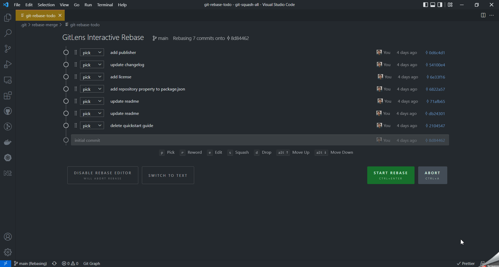

# git-squash-all

Cleaning up a branch after developing a large feature? :technologist:

Don't want your coworkers to see your sloppy commit messages? :see_no_evil:

Squashing your commits is a great feature but manually replacing every "pick" statement can be tedious.

:surfer: Introducing: **git-squash-all** :surfing_woman:

Instantly select _squash_ for every commit in your `git-rebase-todo` (except the first)!

## Features

Run `Git Squash All` while doing an interactive rebase and automatically squash all commits. That's it.

> :rocket: works with GitLens!!

---

**If you find any bugs or have ideas for improvements, let me know!**
